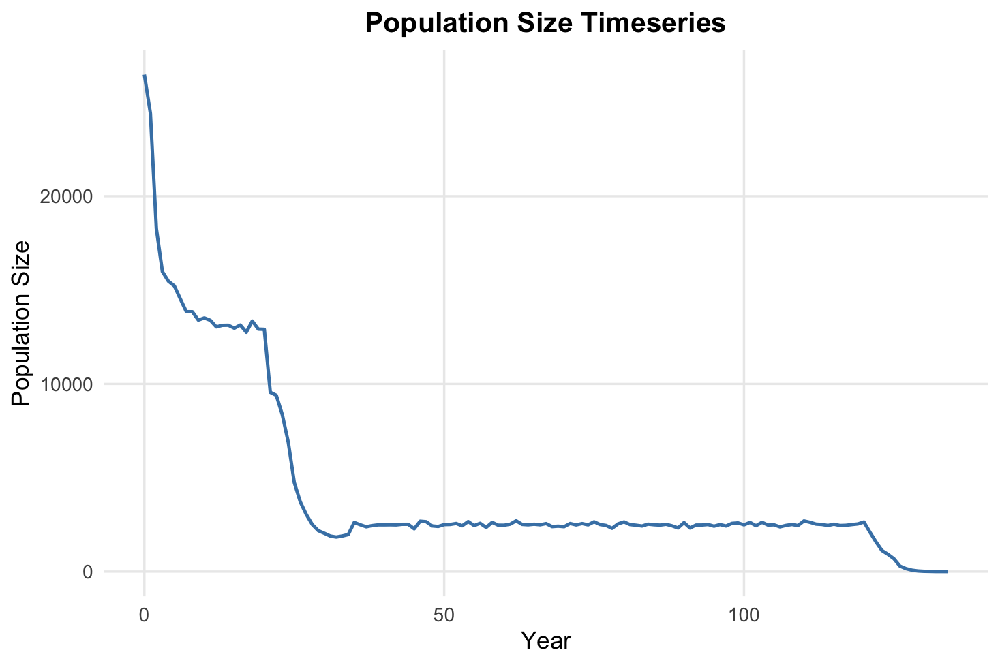
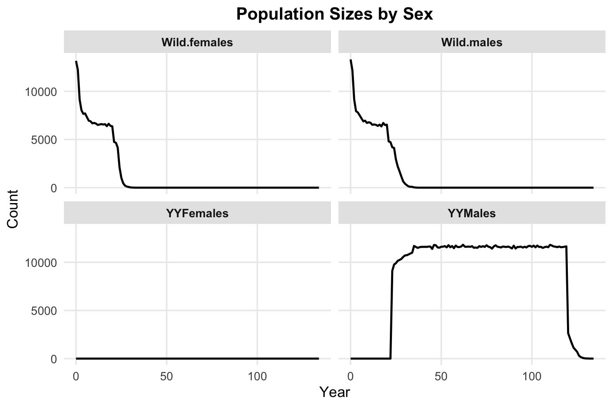
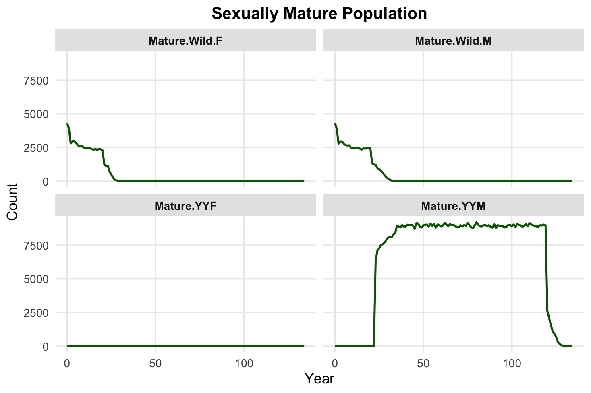
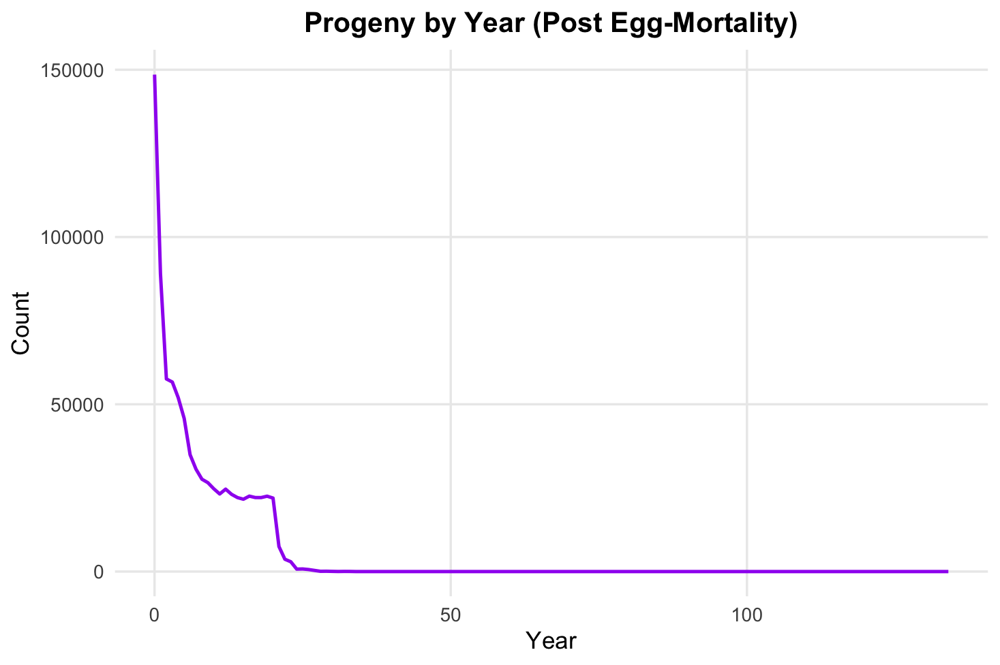
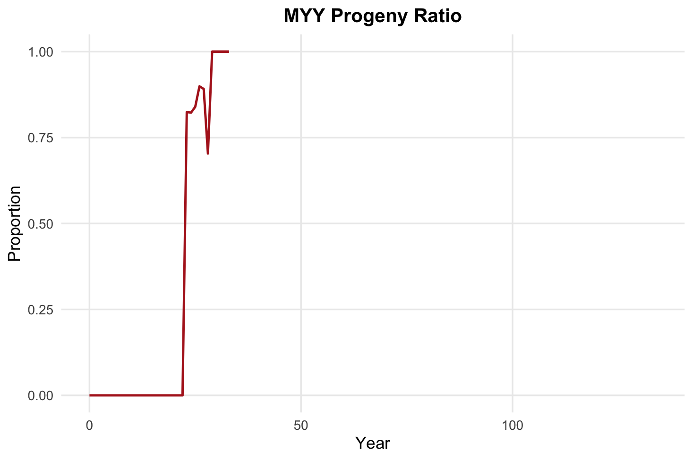
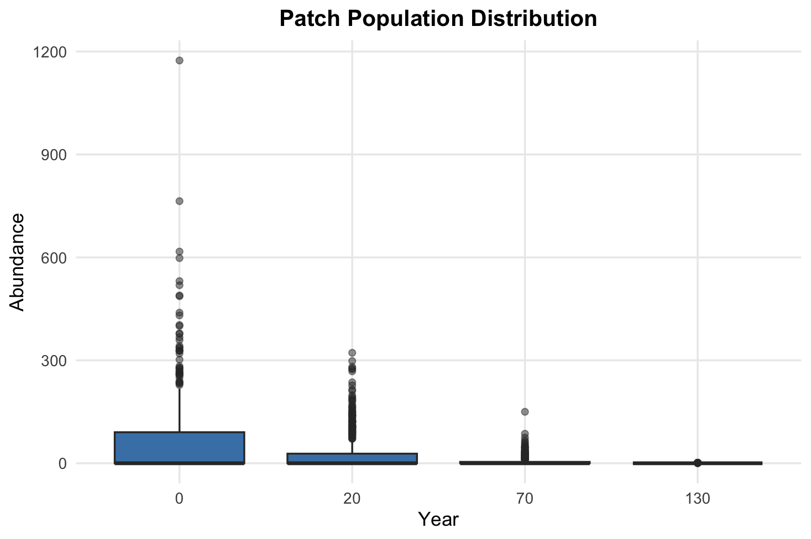
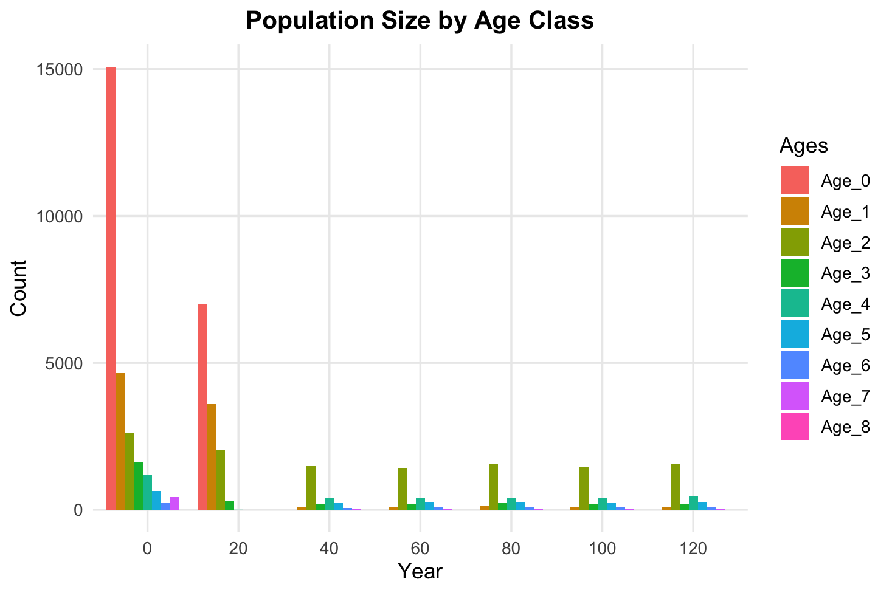
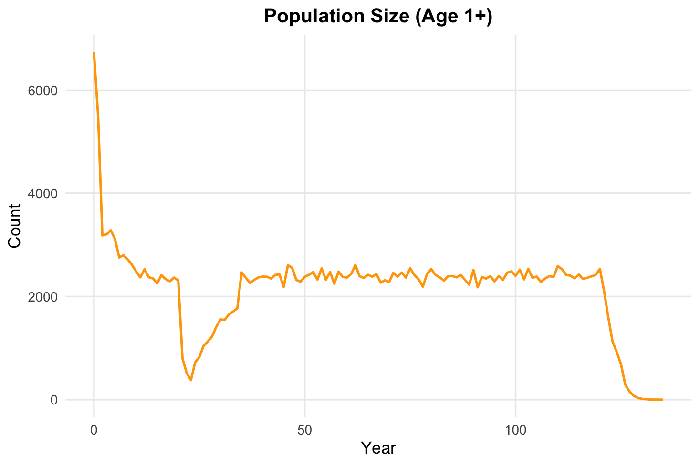

This function generates basic plots any of several population characteristics over time, and it requires as an input either of the two summary files generated by the CDMetaPOP output:

'summary_popAllTime.csv'

'summary_classAllTime.csv'

You can load the data using the `read.csv()` function, `read.RDS()` or provide a path and then use the `plot_population()` function to generate the plots.

``` r
my_data <- read.csv("summary_popAllTime.csv") 

```

**Plot total population size over time.** Using the parameter type = "count" plots the first value of the N_Initial column in the summaryPopAllTime.csv file, which is the total population size at each time step.

``` r
plot_population(my_data, type = "count") 
```



**Plot population size by sex.** Using the parameter type = "sex" plots the population differentiating it by sex, using the first value of the N_Females, N_Males, N_YYMales, and N_YYFemales columns in the summaryPopAllTime.csv file.

``` r
plot_population(my_data, type = "sex") \## old function: pop_sex_plot(my_data)
```

{width="100%"}

**Plot the count of the population that is a mature at a given point in time separated by sex.** To plot this, the function uses the first value of the N_MatureFemales (and the three following columns) of the summaryPopAllTime.csv file.

``` r
plot_population(my_data, type = "mature")
```

{width="100%"}

**Plot births.** Using the parameter type = "births" plots the total count of births overtime, calculated from the summaryPopAllTime.csv file after egg mortality (first column of: Births - EggDeaths).

``` r
plot_population(my_data, type = "births") 
```



**Next , if 'myy_ratio' is chosen for type parameter, a plot with the Myy progeny**

``` r
plot_population(my_data, type = "myy_ratio") 
``` 


**Plot patch population count for specific years.** Using the parameter type = "patch" plots the population size at each patch , using the N_Initial column in the summary_PopAllTime.csv file. The years parameter can be used to specify which years to plot (default is c(0, 10, 20)).

``` r
plot_population(my_data, type = "patch", years = c(0,20, 70, 130))
``` 



The  `plot_population()` function can also be used to plot the population structure in terms of age classes, patch distribution, and the quantity of individuals in the population that are older than 1 year (age 1+) . Make sure to use the summary_classAllTime.csv file for these plots, as they require the age class information. 

``` r
class_data <- read.csv("summary_classAllTime.csv")

``` 

**Age class structure.** Using the parameter type = "age_class" plots the population structure in terms of age classes, using the first value of the N_Initial_Class column in the summary_classAllTime.csv file. The n parameter can be used to specify how long of a interval to plot between time (default is 5).

``` r
plot_population(class_data, type = "age_class", n = 20) 
``` 



**Age1+ structure.** If you need to know population numbers excluding juveniles, you can use the parameter type = "age_plus_one" and you will obtain plots of the population counts for individuals older than 1 year (age 1+). This will use the N_Initial_Class column excluding the first value using the summary_classAllTime.csv file.

``` r
plot_population(class_data, type = "age_plus_one")
``` 

