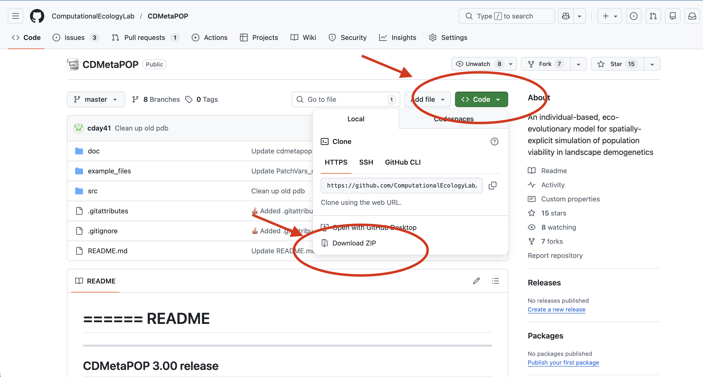

Download the CDMetaPOP zip archive from GitHub:



[Download CDMetaPOP](https://www.github.com/ComputationalEcologyLab/CDMetaPOP/){.btn .btn-primary target="_blank"}


## Installation Steps

1. Navigate to the directory where you wish to install CDMetaPOP
2. Unpack the archive
3. Three directories will be installed:
   - **src** – CDMetaPOP source code
   - **doc** – documents including:
     - README.txt – quick how to run CDMetaPOP instructions
     - CDMetaPOP3_usermanual.docx – user manual
     - CDmetaPOPhistory.txt – version history
   - **example_files** – Example input files

## Requirements

### Python Requirements

Make sure to have Python 3.8+ along with the NumPy and SciPy packages installed. We recommend the Anaconda Python distribution, as it comes with these packages pre-installed.

To test your Python installation, open a terminal (Linux/macOS) or command prompt (Windows) and type:

```bash
python
```

If python is available, you will get the python prompt `>>>` along with the python version you have installed, for example:

```bash
Python 3.12.4 | packaged by Anaconda, Inc. | (main, Jun 18 2024, 10:14:12) [Clang 14.0.6 ] on darwin
Type "help", "copyright", "credits" or "license" for more information
>>> 
```

If 'python' is not a recognized command, it means either that python is installed but not in your command shell's paths, or that python is not installed.

For more detailed installation instructions, please refer to the [CDMetaPOP README](https://github.com/ComputationalEcologyLab/CDMetaPOP?tab=readme-ov-file#requirements-and-pre-requisite-software).

### R Requirements (for cdmetapopR)

If you plan to use cdmetapopR, you will need:

- R (version 4.0 or higher recommended)
- The cdmetapopR package

Install cdmetapopR from CRAN:

```r
install.packages("cdmetapopR")
```

Or install the development version from GitHub:

```r
# install.packages("devtools")
devtools::install_github("ComputationalEcologyLab/cdmetapopR")
```

## Next Steps

After installation, you can:
- [Run CDMetaPOP with Python](python/python_tutorial.qmd)
- [Run CDMetaPOP with cdmetapopR](cdmetapopr/cdmetapopr_tutorial.qmd)
