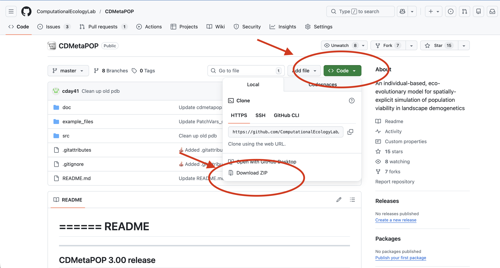

**CDMetaPOP and Python Installation**

First downloaded the CDMetaPOP zip archive from GITHUB

[Download](https://www.github.com/ComputationalEcologyLab/CDMetaPOP/){.btn .btn-primary target="_blank"}



Next, navigate to the directory where you wish to install CDMetaPOP and unpack the archive. Three directories will be installed in the directory you chose:

1.  src – CDMetaPOP source code

2.  doc – documents

    1.  README.txt – a quick how to run CDMetaPOP instructions

    2.  CDMetaPOP_user_manual.pdf

    3.  CDMetaPOP_history.txt – Notes on history and version changes

3.  data – Example input files

Now, make sure to have Python 3.8+, NumPy, and SciPy installed, and you can test this by opening the terminal and typing “python”; If python is available, you will get the python prompt “\>\>\>” along with the python version you have installed, for example:

``` bash
python
Python 3.12.4 | packaged by Anaconda, Inc. | (main, Jun 18 2024, 10:14:12) [Clang 14.0.6 ] on darwin
Type "help", "copyright", "credits" or "license" for more information.
>>> 
```

If 'python' is not a recognized command, it means either that python is installed but not in your command shell’s paths, or that python is not installed.

In such case, please refer to more detailed instructions [here](https://github.com/ComputationalEcologyLab/CDMetaPOP?tab=readme-ov-file#requirements-and-pre-requisite-software).

**Run CDMetaPOP**

Once you have python and CDMetaPOP installed, you can run CDMetaPOP from R using the `launch_cdmetapop()` function.

This function will launch a command prompt (Windows) or terminal (Linux/Mac) that will call Python and supply the 5 arguments needed to launch CDMetaPOP simulations.

The five arguments are:

1.  PYTHON: Location of Python executable, or just 'python' if the environment is already established. To figure out where Python is located in your directories. At the command prompt for Windows, you can type:

``` powershell
where python
```

In the terminal (Linux/Mac), you can type

``` bash
which python 
```

This will give you the location of the python executable, and your first argument for the `launch_cdmetapop()` function.

Make sure the input files you created for your run are in the same directory as the runVars.csv file, and that you have the CDMetaPOP.py file in the same directory as your R session or that you provide the path to it in the second argument.

For example (**make sure to replace paths with yours**):

``` r
library (cdmetapopR)

launch_cdmetapop (
pythonFilepath = "/opt/anaconda3/bin/python", 
CDMetaPOPFilepath = "/Users/comp_eco_lab/CDMetaPop/src/CDMetaPOP.py", 
runvarsDirectory = "/Users/comp_eco_lab/CDMetaPop/data/", 
runvarsFilename = "RunVarsEBT.csv", 
outputDirectory = "test_")
```
